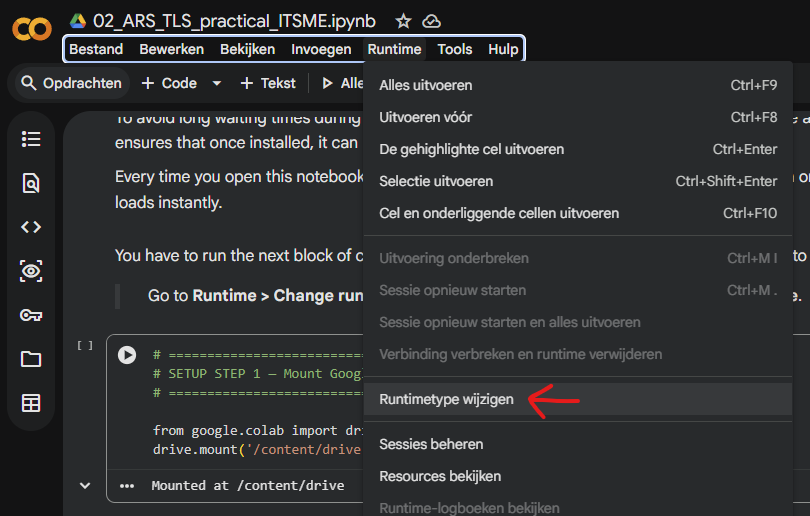
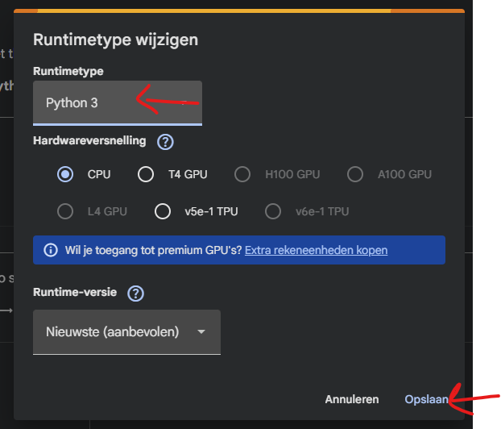
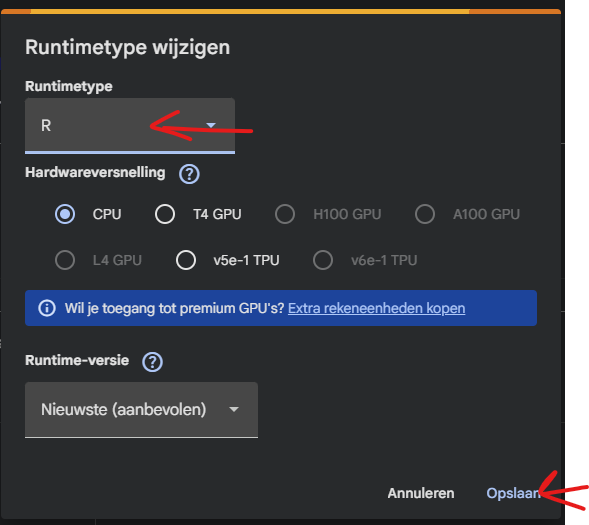

# WORK IN PROGRESS
# Welcome to the TLS Practical Repository for ARS

This is the repository for the **Advanced Remote Sensing (ARS) TLS Practical** at **UGent**.  

## What You'll Learn  

In this practical, you will:  
- Gain an understanding of what **point cloud data** is and how to process it.  
- Use **the RayCloudTools library** to perform instance segmentation on a plot point cloud.  
- Use **CloudCompare** to manually correct instance segmentation of a tree point cloud.
- Use **the RayCloudTools library** to perform 3D modelling on tree point clouds. 
- Use **the ITSMe R package** to calculate structural metrics from tree point clouds.  

This repository contains all the necessary files to **successfully complete the practical**.  

---

## Google colab
Google Colab is a free, cloud-based notebook environment developed by Google. It allows you to write and run code directly in your browser without installing anything on your own computer. We use Google Colab because everyone works in the same environment, it runs in the cloud (so it works on any laptop), files can easily be saved to Google Drive, it ensures the practical runs consistently for everyone. 

## Resources  
### 📌 [01_Google_Colab.md](https://github.com/qforestlab/ARS_TLS_course/01_Google_Colab.md)  
This guide includes **tips and tricks** for using **Google Colab**, the environment that we're using for this practical. 

### 📌 [02_Questions.md](https://github.com/qforestlab/ARS_TLS_course/02_Questions.md)  
This file contains **all the questions** from the notebooks in one place, making it easier to review and answer them.  

---

## How to Get Started  

To set up for the practical, you need to clone this repository to your google drive. 
1. **Open google colab and clone this github repository**  
   - Open google colab at https://colab.research.google.com/ and open a new notebook. In the first code block copy-paste-run:\
   ```from google.colab import drive```\
   ```drive.mount('/content/drive')```\
   Running this code block gives google colab access to your drive. You have to click **connect to google drive** and **continue** on the pop-ups that follow. This is needed to clone the github repository to your drive.
   
   - To make sure we clone the repo in your drive, in the next code block copy-paste-run:\
   ```%cd drive/My\ Drive/```   
   
   - To clone the github repository of this practical to your drive copy-paste-run this code block: 
   ```!git clone https://github.com/qforestlab/ARS_TLS_course.git```\
   This can take 4 minutes.

2. **Pre-installing ITSMe on your google drive**
   - Open your google drive and open the **02_ARS_TLS_practical_ITSME.ipynb** notebook from the ARS_TLS_course folder (that you cloned in the previous step) in your drive. It should automatically open in google colab. 
   - Change your run time settings to Python by clicking on **Runtime > Change runtime type > Runtime type** → choose **Python** → click **Save**.

    

   - Run the first block of code (SETUP STEP 1)
   - Change your run time settings to R by clicking on **Runtime > Change runtime type > Runtime type** → choose **R** → click **Save**.

    
   - Run the second block of code (SETUP STEP 2 & 3)

3. **Open the notebooks**  
   - There are two notebooks, the ...

   - Read the information, execute the code, and try to solve the **🧐 Questions to Think About**.  

---

Good luck! 🍀  

